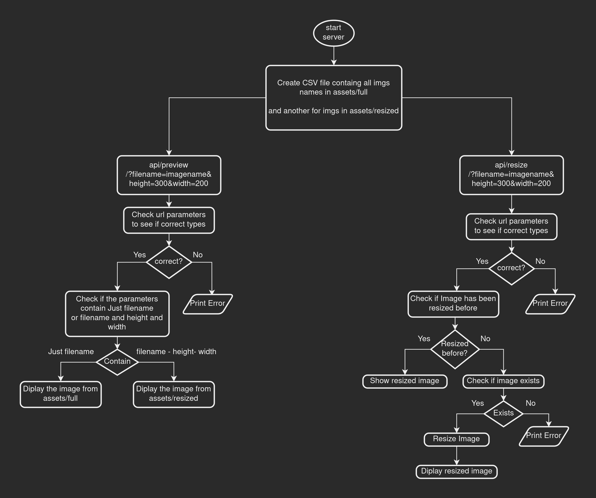
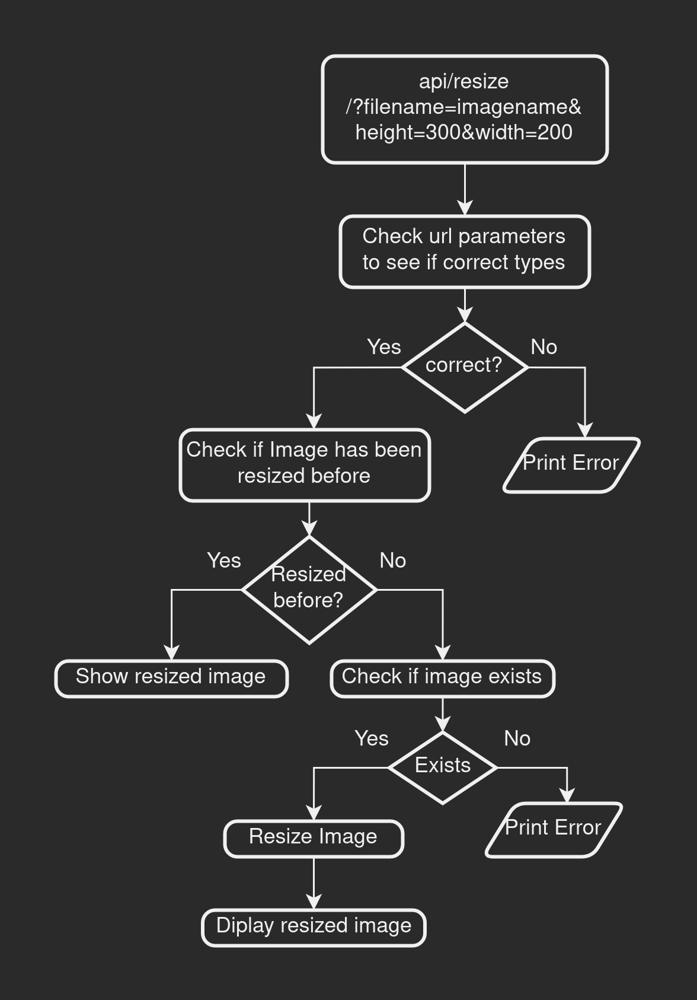
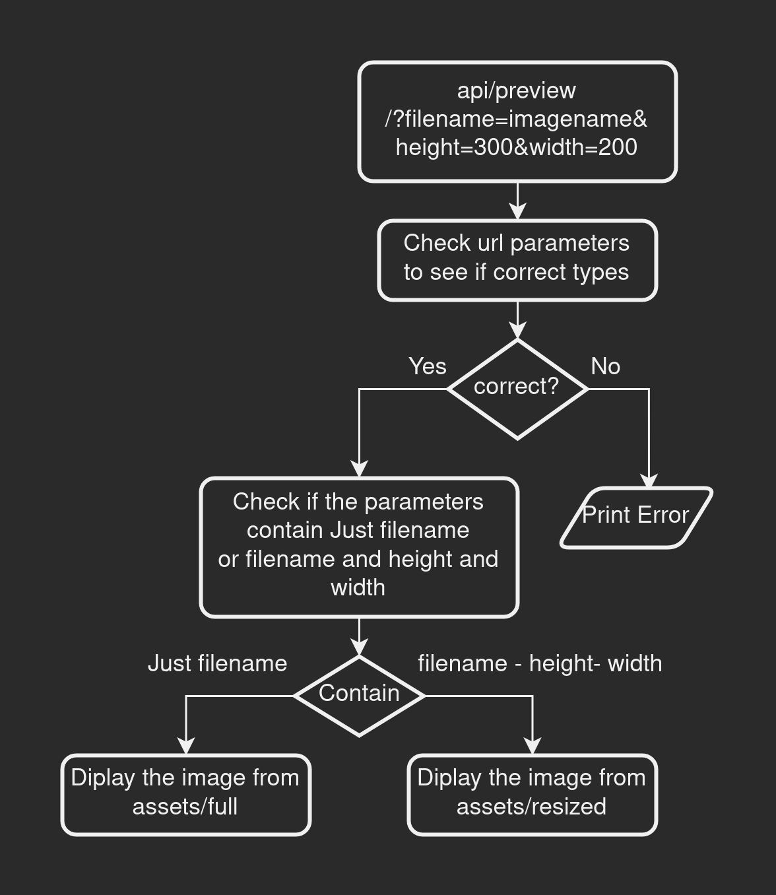

<a name="readme-top"></a>

<h1 align="center">
Image Processing API
</h1>

<p align="center">
API that can be used to scale images via URL parameters.
<br>Udacity NANODEGREE Program - ( First Project )
<br>- By : Yousef Saeed -
</p>

---

## Installation

### Build

```
npm run build
```

Build the TypeScript files into JavaScript files and save the JS files in the `./build` directory.

### Start the server

```
npm run start
```

Start running the server on port `3000`.

<br>

### Other Scripts

```
npm run dev
```

Start running the server w/ **nodemon** from src/app.ts

```
npm run devjs
```

Start running the server w/ **nodemon** from build/app.js

```
npm run test
```
Build and run Jasmine

```
npm run jasmine
```

Run Jasmine w/o building

```
npm run prettier
```

Run Prettier

```
npm run lint
```

Run ESLint


## ENDPOINT

### Resize Image

`Example: http://localhost:3000/api/resize/?filename=<ImageName>&height=<height>&width=<width>`

Resize the image `filename` using the `Height` and `Width` in the URL parameters.

### Preview Image

#### URL does have `Height` and `Width` parameters

`Example: http://localhost:3000/api/preview/?filename=<ImageName>&height=<height>&width=<width>`

Diplay resized image from assets/resized

#### URL does have *only* `filenane` parameter

`Example: http://localhost:3000/api/preview/?filename=<ImageName>`

Diplay full size image from assets/full


## FLOWCHART







## Built With

* [![Node][node.shield]][node-url]
* [![TypeScript][ts.shield]][ts-url]
* [![Jasmine][jasmine.shield]][jasmine-url]
* [![Express][express.shield]][express-url]
* [![Sharp][sharp.shield]][sharp-url]

## Notes:

- If you want to preview an image after resizing it, you have to change the route from `api/resize` to `api/preview`.

- After planning for using *EJS*, I changed my mind. So it doesn't serve any purpose in the code now.


## Changelog

- ***22/8*** &nbsp; Final Edits and added some comments for easier navigation in the code.

- ***21/8*** &nbsp; Added Preview Route.

- ***20/8*** &nbsp; EJS.

- ***19/8*** &nbsp; Added middleware to Check if same image is resized with same dimensions before.

- ***18/8*** &nbsp; Added middleware to check if image exists.

- ***17/8*** &nbsp; Added middleware to write existing image names into CSV file and another for resized images.

- ***15/8*** &nbsp; Configuration & Scripts.

- ***14/8*** &nbsp; Configured Jasmine.

- ***13/8*** &nbsp; Run the server on port 3000 `http://localhost:3000`.

- ***13/8*** &nbsp; Initialize Project Structure.


## Resources

- Find a string in a file : https://stackoverflow.com/a/17449232/18250861

- Write files names in directory to a file : https://stackoverflow.com/a/51125945/18250861


<p align="right">(<a href="#readme-top">Back to Top</a>)</p>


[node.shield]: https://img.shields.io/badge/Node.js-43853D?style=for-the-badge&logo=node.js&logoColor=white
[node-url]: https://nodejs.org/

[ts.shield]: https://img.shields.io/badge/TypeScript-007ACC?style=for-the-badge&logo=typescript&logoColor=white
[ts-url]: https://www.typescriptlang.org/

[jasmine.shield]: https://img.shields.io/badge/jasmine.js-8a4182?style=for-the-badge&logo=jasmine&logoColor=white
[jasmine-url]: https://jasmine.github.io/

[express.shield]: https://img.shields.io/badge/Express.js-404D59?style=for-the-badge&logo=express&logoColor=white
[express-url]: https://expressjs.com/

[sharp.shield]: https://img.shields.io/badge/sharp.js-009900?style=for-the-badge&logo=sharp&logoColor=white
[sharp-url]: https://sharp.pixelplumbing.com/

